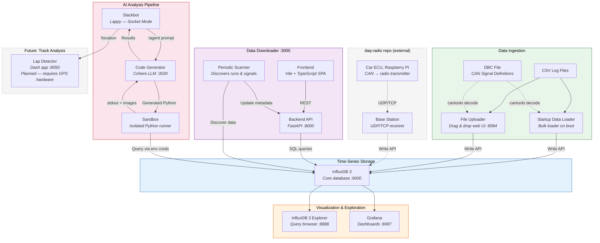

# Western Formula Racing DAQ Components

This repository hosts the Docker-based telemetry stack that powers Western Formula Racing’s data acquisition (DAQ) pipeline. It is designed to be publicly shareable: all runtime credentials live in `.env` files, sample datasets are anonymised, and every container is documented for easy onboarding.

## Repository layout

| Path | Description |
| --- | --- |
| `installer/` | Docker Compose deployment, container sources, and environment templates. |
| `docs/` | Public-facing documentation for each service and the compose stack. |
| `dev-utils` | Development utility scripts (not for production use). |
## Quick start

1. Install Docker Desktop (macOS/Windows) or Docker Engine + Compose V2 (Linux).
2. Navigate to the installer and copy the environment template:
   ```bash
   cd installer
   cp .env.example .env
   # Update values before deploying outside of local development
   ```
3. Launch the stack:
   ```bash
   docker compose up -d
   ```
4. Visit the services:
   - InfluxDB 3 Explorer – http://localhost:8888
   - Grafana – http://localhost:8087
   - Drag and Drop CSV File uploader – http://localhost:8084
   - Data Downloader - http://localhost:3000

All services share a bridge network named `datalink` and rely on the admin token supplied through `.env`.

## System architecture



## System overview

The compose stack deploys eight cooperating containers:

1. **InfluxDB 3** – Time-series database seeded with a tiny example dataset.
2. **InfluxDB 3 Explorer** – Web UI for browsing and querying telemetry.
3. **Grafana** – Pre-provisioned dashboards that visualise the stored telemetry.  Load your own dashboard provisioning files into `installer/grafana/dashboards/`.
4. **Sandbox** - *Under active development.* Connecting InfluxDB3 with LLM for natural language queries and analysis.
5. **Slack bot d.b.a. Lappy** – Optional automation/notification bot for race ops.
6. **Lap analysis app** – *Under active development.* Dash-based location data visualiser and lap timer. (Useful if GPS data is available.) 
7. **Startup data loader** – Seeds the database on boot with sample CAN frames.
8. **File uploader** – Streams uploaded CSV logs into InfluxDB using the shared DBC file.
9. **Data downloader** - Scans InfluxDB periodically, visual SQL query builder, and CSV export service.

Detailed documentation for each service is available in `docs/containers/`.

## Sample data & DBC files

The repository ships with `example.dbc` (a minimal CAN database) and a sample dataset (`2025-01-01-00-00-00.csv`) containing four rows of synthetic telemetry. Replace both assets with production data when working with real vehicles.

## Working with environment variables

Every container reads its credentials from the `.env` file co-located with `docker-compose.yml`. Refer to `installer/.env.example` for the exhaustive list. Never commit real tokens—keep personal overrides in `.env` and add `.env` to your global gitignore.

## Documentation index

- [Compose stack reference](docs/docker-compose.md)
- [Container documentation](docs/containers/)
- [Grafana dashboards](installer/grafana/)
- [Startup data loader](installer/startup-data-loader/README.md)

## Contributing

TBD

## Hardware Dependencies
https://github.com/Western-Formula-Racing/ECU_25


## Acknowledgements
This project was developed in 2024 and maintained by the Western Formula Racing Data Acquisition team, inspired by the team's prior work on telemetry systems for our Formula SAE vehicles.
https://github.com/Western-Formula-Racing/RaspberryPi-CAN-DAQ-MVP
https://github.com/Western-Formula-Racing/daq-2023


We also want to acknowledge the open-source tools and libraries that make this project possible. Key components include:
* Docker / Docker Compose for containerisation
* InfluxDB 3 for time-series storage
* Grafana for visualisation
* Python open-source packages (NumPy, Pandas, Requests, etc.) used throughout the stack

### Explore more work from Western Formula Racing

If you’re interested in our team’s broader engineering projects, here are some of the hardware systems developed alongside this DAQ stack:
* https://github.com/Western-Formula-Racing/ECU_25
* https://github.com/Western-Formula-Racing/Custom-BMS_25
* https://github.com/Western-Formula-Racing/mobo-25

## Under Active Development
1. Slack bot improvements + sandbox
2. Lap analysis app


## License
AGPL-3.0 License. See LICENSE file for details.