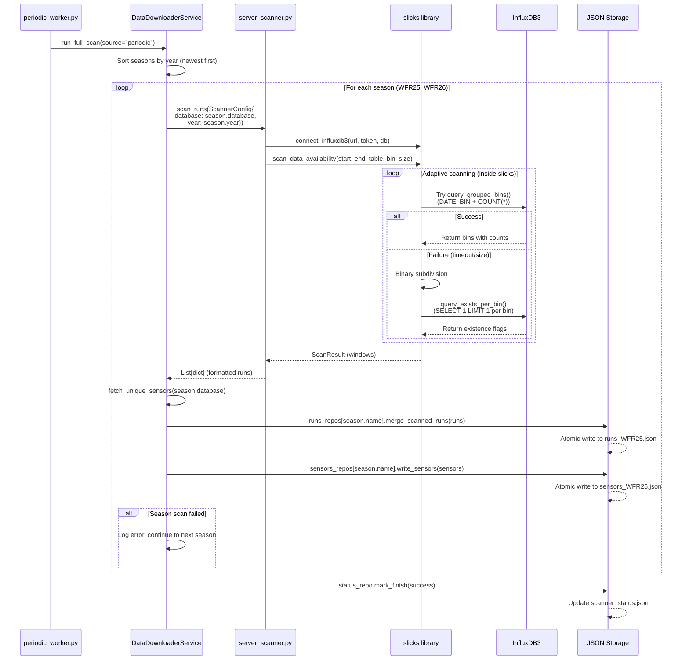

# Data Downloader Webapp

This project packages the DAQ data-downloader experience into a small stack:

- **React frontend** (`frontend/`) for browsing historic runs, triggering scans, and annotating runs.
- **FastAPI backend** (`backend/`) that reads/writes JSON state, exposes REST endpoints, and can launch scans on demand.
- **Scanner worker** (separate Docker service) that periodically runs the InfluxDB availability scan plus the unique sensor collector and exports the results to `data/runs.json` and `data/sensors.json`.

Both JSON files are shared through the `./data` directory so every service (frontend, API, scanner) sees the latest state. Notes added in the UI are stored in the same JSON payload next to the run entry.

## Getting started

1. Duplicate the sample env file and fill in the InfluxDB credentials:
   ```bash
   cp .env.example .env
   ```
2. Build + launch everything:
   ```bash
   docker compose up --build
   ```
3. Open http://localhost:3000 to access the web UI, and keep the API running on http://localhost:8000 if you want to call it directly.

## Runtime behaviour


- `frontend` serves the compiled React bundle via nginx and now proxies `/api` requests (including `/api/scan` and `/api/scanner-status`) directly to the FastAPI container. When the UI is loaded from anything other than `localhost`, the client automatically falls back to relative `/api/...` calls so a single origin on a VPS still reaches the backend. Override `VITE_API_BASE_URL` if you want the UI to talk to a different host (for example when running `npm run dev` locally) and keep that host in `ALLOWED_ORIGINS`.
- `api` runs `uvicorn backend.app:app`, exposing
  - `GET /api/runs` and `GET /api/sensors`
  - `POST /api/runs/{key}/note` to persist notes per run
  - `POST /api/scan` to fire an on-demand scan that refreshes both JSON files in the background
  - `POST /api/data/query` to request a timeseries slice for a given `signalName` between two timestamps; the response echoes the exact SQL (matching `sql.py`) so the frontend can display the query being executed.
- `scanner` reuses the same backend image but runs `python -m backend.periodic_worker` so the scan + unique sensor collection happens at the interval defined by `SCAN_INTERVAL_SECONDS`.

Set `INFLUX_SCHEMA`/`INFLUX_TABLE` to the same values used in the legacy scripts (e.g. `iox` + `WFR25`) so the SQL sent from `backend/server_scanner.py` and `backend/sql.py` matches the proven queries.

All services mount `./data` inside the container and the FastAPI layer manages file I/O with atomic writes to keep data consistent between the worker and UI actions. If the rolling lookback produces no sensors, the collector now falls back to the oldest/newest run windows discovered by the date scanner, so no manual date tuning is required.
