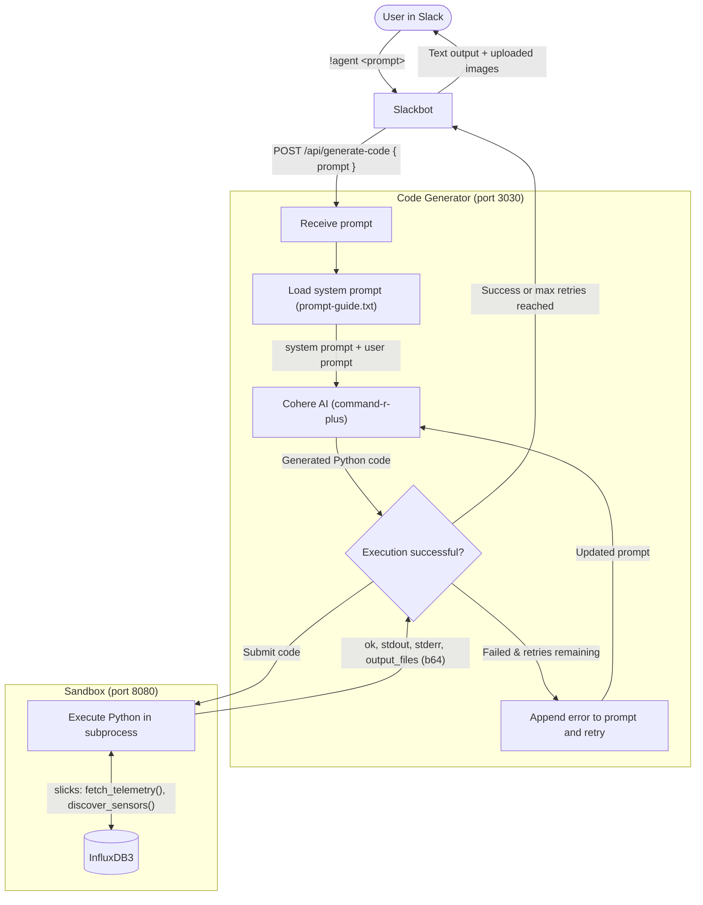

# AI-Powered Code Generation & Sandbox Execution

Generate and execute Python code for telemetry analysis using Cohere AI and a custom sandboxed execution environment. Integrated with the Slackbot for natural language queries.

## Architecture



### Components

1. **Code Generator** (`code_generator.py`)
   - Receives natural language prompts
   - Uses Cohere AI to generate Python code
   - Implements automatic retry logic (up to 2 retries)
   - Appends error messages to prompts on retry for self-correction

2. **Custom Sandbox** (`sandbox_server.py`)
   - HTTP server that executes Python code in isolated environment
   - **Has internet access** for InfluxDB queries and API calls
   - Uses the [`slicks`](https://pypi.org/project/slicks/) package for data access (wraps InfluxDB, movement detection, sensor discovery)
   - Supports full Python ecosystem: slicks, matplotlib, pandas, numpy, plotly, scikit-learn
   - Auto-captures output files (images, data)
   - Configurable timeout and resource limits

## Setup

The sandbox services are automatically started with the main docker-compose stack.

### Environment Variables

Add to your `.env` file:

```bash
# Required: Cohere API key
COHERE_API_KEY=your-cohere-api-key-here

# Optional: Cohere model (default in docker-compose: command-r-plus; code default: command-a-reasoning-08-2025)
COHERE_MODEL=command-r-plus

# Optional: Max retry attempts (default: 2)
MAX_RETRIES=2

# Optional: InfluxDB database name (default: telemetry)
INFLUXDB_DATABASE=telemetry
```

### Prompt Engineering Setup

**First time setup:**
```bash
cd installer/sandbox
cp prompt-guide.txt.example prompt-guide.txt
# Edit prompt-guide.txt with your custom prompt engineering
```

**Note:** `prompt-guide.txt` is gitignored to keep your custom prompt engineering private. The `.example` file serves as a template and can be committed.

### Starting the Services

From the `installer/` directory:

```bash
# Start all services including sandbox
docker compose up -d

# Or start only sandbox services
docker compose up -d sandbox code-generator
```

### Testing

Test the code generation API directly:

```bash
curl -X POST http://localhost:3030/api/generate-code \
  -H "Content-Type: application/json" \
  -d '{
    "prompt": "Create a scatter plot of random voltage vs current data and save as output.png"
  }'
```

## Usage from Slack

Use the `!agent` command in Slack:

```
!agent plot inverter voltage vs current from the last hour
!agent show me battery temperature trends over time
!agent analyze motor RPM and torque correlation
```

### How It Works

1. User sends `!agent <prompt>` in Slack
2. Slackbot forwards prompt to Code Generator service
3. Code Generator:
   - Loads system prompt with InfluxDB connection details
   - Calls Cohere AI to generate Python code
   - Submits code directly to Custom Sandbox for execution
4. Custom Sandbox:
   - Executes Python code with full internet access
   - Can query InfluxDB, make API calls, generate plots
   - Returns stdout, stderr, and output files
5. If code fails:
   - Error message is appended to the prompt
   - Cohere generates fixed code
   - Process repeats up to MAX_RETRIES times
6. Results sent back to Slack:
   - Text output shown in message
   - Images uploaded as files
   - Success/failure status with retry count

### Example Interactions

**Simple Plot:**
```
User: !agent create a random scatter plot
Bot:  Processing your request...
Bot:  Code executed successfully!
Bot:  Here's your visualization: [output.png]
```

**With Retry:**
```
User: !agent plot df['time'] data
Bot:  Processing your request...
Bot:  Initial code had errors. Retried 1 time(s) with error feedback.
Bot:  Code executed successfully! (after 1 retry)
Bot:  Output: Data plotted successfully
```

**Failure After Retries:**
```
User: !agent impossible task
Bot:  Processing your request...
Bot:  Initial code had errors. Retried 2 time(s) with error feedback.
Bot:  Code execution failed after 2 retries:
      ERROR_TRACE: [error details]
```

## System Prompt

The code generator uses a system prompt (`prompt-guide.txt`) to guide Cohere's code generation.

**Setup:**
1. Copy the template: `cp prompt-guide.txt.example prompt-guide.txt`
2. Edit `prompt-guide.txt` with your custom prompt engineering
3. File is gitignored - your custom prompts stay private

**The system prompt should include:**
- Available libraries and the `slicks` package API
- Example usage of `slicks.fetch_telemetry()`, `slicks.discover_sensors()`, etc.
- Visualization best practices
- Sandboxed execution rules (no user input, save files)
- Domain-specific guidance for your telemetry data

**Template file:** `prompt-guide.txt.example` is committed as a starting point for others.

## API Endpoints

### Code Generator Service (Port 3030)

**POST /api/generate-code**
```json
{
  "prompt": "your natural language request"
}
```

Response:
```json
{
  "code": "generated Python code",
  "result": {
    "status": "success",
    "output": "stdout text",
    "error": "stderr text",
    "files": [
      {
        "name": "output.png",
        "data": "base64-encoded-image",
        "type": "image"
      }
    ]
  },
  "retries": [
    {
      "attempt": 1,
      "error": "previous error message"
    }
  ]
}
```

**GET /api/health**
```json
{
  "status": "ok",
  "service": "code-generator"
}
```

### Sandbox Runner Service (Port 8080)

**POST / or /execute**
```json
{
  "code": "print('hello world')"
}
```

Response:
```json
{
  "ok": true,
  "std_out": "hello world\n",
  "std_err": "",
  "return_code": 0,
  "output_files": [
    {
      "filename": "output.png",
      "b64_data": "base64-encoded-bytes"
    }
  ]
}
```

## Monitoring

View logs for debugging:

```bash
# All sandbox services
docker compose logs -f sandbox code-generator

# Individual services
docker compose logs -f code-generator
docker compose logs -f sandbox
```

## Security

- Code executes in isolated subprocess with timeout limits
- **Has internet access** for InfluxDB queries via `slicks` and API calls
- Limited runtime (120 seconds max, configurable via `SANDBOX_TIMEOUT`)
- Limited memory and file size
- InfluxDB credentials passed via environment variables (consumed by `slicks` automatically)
- Generated code is logged for audit purposes

## Troubleshooting

**Code Generator can't connect to Cohere:**
- Check `COHERE_API_KEY` is set correctly in `.env`
- Verify API key has sufficient credits

**Sandbox execution fails:**
- Check sandbox container is running: `docker ps | grep sandbox`
- View sandbox logs: `docker compose logs sandbox`
- Verify Terrarium image pulled successfully

**Slackbot can't reach Code Generator:**
- Ensure all services on same Docker network (`datalink`)
- Check service names match: `code-generator`, `sandbox`
- Verify CODE_GENERATOR_URL in slackbot environment

**Generated code keeps failing:**
- Check the system prompt in `prompt-guide.txt`
- Increase MAX_RETRIES if needed
- View generated code in container logs
- Ensure InfluxDB credentials are correct

## Development

To modify the code generator locally:

```bash
cd installer/sandbox

# Edit code
vim code_generator.py

# Rebuild and restart
docker compose up -d --build code-generator
```

## Files

- `code_generator.py` - Main Cohere integration and retry logic
- `sandbox_server.py` - Custom Python sandbox execution server
- `prompt-guide.txt.example` - Template for system prompt (copy to `prompt-guide.txt`)
- `prompt-guide.txt` - Your custom system prompt (gitignored)
- `Dockerfile` - Code generator container image
- `Dockerfile.sandbox` - Custom sandbox container image
- `requirements.txt` - Python dependencies for code generator
- `requirements-docker.txt` - Python dependencies for sandbox (includes `slicks` and scientific libraries)
- `docker-compose.yml` - Standalone compose file (not used in main stack)


